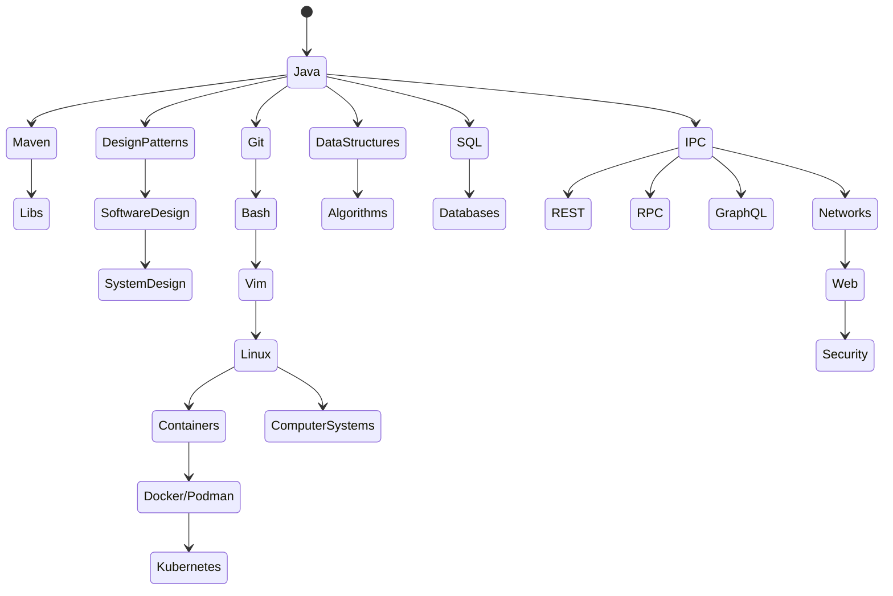

# Java back-end web development

This list does not aim by no means to be complete, since just based on my personal (limited) experience. It's rather meant to offer a roughly sketched learning path to get into Java for server-side programming with web development in mind: it mentions the most relevant concepts and tools a newbie can encounter in his/her work routine as a Java developer. The last sections tries to go beyond Java.

Other stuff you may like:
- [Awesome Java](https://github.com/akullpp/awesome-java#cluster-management): a huge list of stuff regarding Java
- [Web Developer RoadMap](https://github.com/kamranahmedse/developer-roadmap): for a more general view of what is useful/required to develop for the web.

Below you can find a visual summary of the list:

---
## Java
- [A Brief History of the Java Programming Language](https://www.baeldung.com/java-history)
- Programming Language Fundamentals[^1]:
  - JRE, JDK & [JVM](https://shipilev.net/jvm/anatomy-quarks/)
  - Byte Code vs. Machine Code
       - [Java Bytecode Simplified: Journey to the Wonderland](https://foojay.io/today/java-bytecode-simplified-journey-to-the-wonderland-part-1/)
  - Compiling with `javac` and Running with Arguments from CLI
  - IDE[^2]
     - [**!OPINION**] [Stop Making Students Use Eclipse](https://nora.codes/post/stop-making-students-use-eclipse/)
     - [VSCode](https://code.visualstudio.com/docs/languages/java)
     - [Debugging](https://code.visualstudio.com/docs/java/java-debugging)
  - Heap & Stack
  - Variables
  - Arithmetic & Boolean Expressions
  -  Built-in Types of Data
     - Default Initialization
     - Wrappers & Autoboxing
  -  Arrays
  - The Object Class
      - `this` & `super` keywords
      - `equals()` & `hashCode()` methods
  - Constants & Enumerations
  - Access Modifiers
  - Classes & Object-Oriented Programming (OOP) Basic Concepts
      - Interfaces vs. Abstract Classes (Abstraction)
      - Nested Classes, Inner Classes & Anonymous Classes
      - Inheritance vs. Composition
      - Polymorphism & Upcasting vs. Downcasting
      - Encapsulation & Data Hiding
  - Control Flow Statements
  - Methods
      - Passing-by-Value vs. Passing-by-Reference
      - Overloading & Overriding
      - The `main` method
  - Exceptions
      - Throwable, Exception & Error
      - Checked vs. Unchecked
      - Try/Catch & Catch-or-Declare Requirement
  - Collections
      - Iterable & Iterator
      - Comparable & Comparator
      - Sorting & Searching
      - Stack & Queue
      - List, Set & Map
  - I/O
  - Streams
  - Lambda Expressions & Method References
  - Recursion
      -  [The Three Laws of Recursion](https://pages.di.unipi.it/marino/python/Recursion/TheThreeLawsofRecursion.html)
- Build Automation Tools:
     - [Ant vs Maven vs Gradle](https://www.baeldung.com/ant-maven-gradle)
     - [**!OPINION**] [Why I Moved Back from Gradle to Maven](https://phauer.com/2018/moving-back-from-gradle-to-maven/)
- Scripting: JShell, [JBang](https://github.com/maxandersen/jbang)
- Horstmann, Core Java Fundementals (Vol. 1 & 2)
- Bloch, Effective Java
- [Design Patterns](https://java-design-patterns.com/)
- Unit Testing:
  - Kosleka, Effective Unit Testing
  - Tahchiev, JUnit in Action
  - Kosleka, Test Driven: TDD and Acceptance TDD for Java Developers
- Advanced Topics:
   - Generics
   - Reflection
   - Concurrency, Multi-threading, Parallelism and Asynchronus Programming:
       - [5 Things You Probably Didn't Know About Java Concurrency](https://foojay.io/today/5-things-you-probably-didnt-know-about-java-concurrency/?utm_content=202308183&utm_medium=social&utm_source=twitter&hss_channel=tw-2599580401)
       - [Applying Concurrency and Multi-threading to Common Java Patterns](https://www.pluralsight.com/courses/java-patterns-concurrency-multi-threading)
       - [Advanced Java Concurrent Patterns](https://www.pluralsight.com/courses/java-concurrent-patterns-advanced)
       - [Java Fundamentals: Asynchronous Programming Using CompletionStage](https://www.pluralsight.com/courses/java-fundamentals-asynchronous-programming-completionstage)
       - [**!WIP**] [Project Loom](https://openjdk.org/jeps/425)
         - [**!WARNING**] [Loom and Thread Fairness](https://www.morling.dev/blog/loom-and-thread-fairness/)
   - Reactive Programming
       - [The introduction to Reactive Programming you've been missing](https://gist.github.com/staltz/868e7e9bc2a7b8c1f754)
       - [The Essence of Reactive Programming in Java](https://www.scnsoft.com/blog/java-reactive-programming)
       - [5 Things to Know About Reactive Programming](https://developers.redhat.com/blog/2017/06/30/5-things-to-know-about-reactive-programming)
       - [The Difference Between a Reactive Non-Blocking Model and Classic Asynchronous Code](https://nickolasfisher.com/blog/The-Difference-Between-a-Reactive-NonBlocking-Model-and-Classic-Asynchronous-Code)
       - [EventLoop vs Thread per Request Model](https://singhkaushal.medium.com/spring-webflux-eventloop-vs-thread-per-request-model-a42d07ee8502)
       - [Explaining event loop in 100 lines of code](https://iximiuz.com/en/posts/explain-event-loop-in-100-lines-of-code/)
- Java APIs
   - [The Java Version Almanac](https://javaalmanac.io/)
   - [New language features since Java 8 to 17](https://advancedweb.hu/new-language-features-since-java-8-to-17/)

---

## Algorithms & Data Structures
- [Asymptotic notation](https://www.khanacademy.org/computing/computer-science/algorithms/asymptotic-notation/a/asymptotic-notation)
- Sedgewick & Wayne, Algorithms [1](https://www.coursera.org/learn/algorithms-part1) + [2](https://www.coursera.org/learn/algorithms-part2)
- Kopec, Classic Computer Science Problems in Java
- [Open Data Structures (in Java)](http://opendatastructures.org/ods-java/)
- [**!OPINION**] [Data Structures & Algorithms I Used Working at Tech Companies](https://blog.pragmaticengineer.com/data-structures-and-algorithms-i-actually-used-day-to-day/)
- [HackerRank](https://www.hackerrank.com/)
- [LeetCode](https://leetcode.com/)
- [**!BONUS**] [Visualizing Algorithms](https://bost.ocks.org/mike/algorithms/)

---

## Software Design
- Ousterhout, A Philosophy of Software Design
- Martin, Clean Code
- Hunt & Thomas, The Pragmatic Programmer: From Journeyman to Master
- Brooks, The Mythical Man-Month
- Fowler, Patterns of Enterprise Application Architecture
- GoF, Design Patterns: Elements of Reusable Object-Oriented Software
- Martin, Clean Code: A Handbook of Agile Software Craftsmanship
- Beck & Fowler, Refactoring: Improving the Design of Existing Code
- Winters et al., Software Engineering at Google: Lessons Learned from Programming Over Time
- [**!BONUS**] Norman, [*The Design of Everyday Things*](https://en.wikipedia.org/wiki/The_Design_of_Everyday_Things)
- [**!BONUS**] Alexander et al., [The Timeless Way of Building](https://en.wikipedia.org/wiki/The_Timeless_Way_of_Building) + [*A Pattern Language: Towns, Buildings Construction*](https://en.wikipedia.org/wiki/A_Pattern_Language)
- [**!BONUS**] Meadows, Thinking in Systems: A Primer
- [**!BONUS**] Hermans, The Programmer's Brain: What every programmer needs to know about cognition

---

## Most Popular Libraries, Frameworks and Tools for Java
- [**!BONUS**] [Technology Radar. An opinionated guide to technology frontiers](https://www.thoughtworks.com/radar)
 - [**!OPINION**] [Why not use java.util.logging?](https://stackoverflow.com/questions/11359187/why-not-use-java-util-logging)
 - [Mapped Diagnostic Context (MDC)](https://www.baeldung.com/mdc-in-log4j-2-logback)
- Boilerplate Code Auto-generation: [Project Lombok](https://projectlombok.org/)
- POJO-DTO Mapping: [**MapStruct**](https://mapstruct.org/)
- Bean Validation: [Hibernate Validator](https://hibernate.org/validator/documentation/getting-started/)
- Persistence:
   - [JDBC](https://www.baeldung.com/jpa-vs-jdbc)
   - JPA
     - [Hibernate](https://www.baeldung.com/learn-jpa-hibernate)
       - [HQL/JPQL](https://docs.jboss.org/hibernate/orm/-3/devguide/en-US/html/ch-html)
       - Vlad Mihalcea, [blog](https://vladmihalcea.com/blog/) + [High-Performance Java Persistence](https://vladmihalcea.com/books/high-performance-java-persistence/)
       - [Hibernate Performance Tuning Tips](https://thorben-janssen.com/tips-to-boost-your-hibernate-performance/?utm_source=social&utm_medium=twitter&utm_campaign=tutorial)
     - EclipseLink
     - Apache OpenJPA
- [Cache Providers](https://blog.frankel.ch/choose-cache/2/): Caffeine, Ehcache, Infinispan, Hazelcast, Redis, Apache Ignite
- Message Processing:
 - JMS (**Apache ActiveMQ**, **RabbitMQ**)
- Event Streaming:
 - **Apache Kafka**
- Data Serialization:
   - Java Serialization (Native APIs)
     - [**!OPINION**] [Why Java's serialization slower than 3rd party APIs?](https://stackoverflow.com/questions/19447623/why-javas-serialization-slower-than-3rd-party-apis)
   - Language-agnostic Formats:
     - XML:
       - Java Architecture for XML Binding (JAXB)
     - JSON:
       - [**Jackson**](https://www.baeldung.com/jackson)
         - [Turbo-charging Jackson](https://github.com/FasterXML/jackson-docs/wiki/Presentation:-Jackson-Performance)
       - Gson
       - JSON-P & JSON-B
     - YAML:
       - YAML Beans
       - SnakeYAML
     - [Schema-based Binary Format](https://martin.kleppmann.com/2012/12/05/schema-evolution-in-avro-protocol-buffers-thrift.html):
       - [**Protocol Buffers**](https://developers.google.com/protocol-buffers/docs/javatutorial) (protobuf)
       - [**Apache Thrift**](https://thrift.apache.org/tutorial/java.html)
       - [**Apache Avro**](https://avro.apache.org/docs/current/gettingstartedjava.html)
- File Manipulation:
 - Microsoft Documents: [**Apache POI**](https://www.baeldung.com/java-microsoft-excel)
 - PDF: [**iText**](https://www.baeldung.com/java-pdf-creation)/[**OpenPDF**](https://github.com/LibrePDF/OpenPDF)
 - HTML: [**Mustache**](https://www.baeldung.com/mustache)
- [JAX-WS](https://www.baeldung.com/jax-ws) (**Axis2**, **Apache CXF**)
- [JAX-RS](https://www.baeldung.com/jax-rs-spec-and-implementations) (**RESTEasy**, **Jersey**, **Apache CXF**)
- API documentation: [**Swagger**](https://swagger.io/tools/open-source/open-source-integrations/)
- [JEE](https://www.baeldung.com/java-enterprise-evolution) (**Apache Tomcat**, **Jetty**, **WebSphere**, **WildFly**, **GlassFish**, **JBoss EAP**, **Open Liberty**):
 - [Modern Java EE design patterns](https://www.oreilly.com/content/modern-java-ee-design-patterns/)
 - [Difference between an application server and a servlet container?](https://stackoverflow.com/questions/5039354/difference-between-an-application-server-and-a-servlet-container)
 - [**!OPINION**] [Why Kubernetes is The New Application Server](https://developers.redhat.com/blog/2018/06/28/why-kubernetes-is-the-new-application-server#)
- [Dependency Injection](https://dzone.com/articles/dependency-injection-implementation-in-core-java-1):
 - [Spring](https://spring.io/projects/):
     - Walls, Spring in Action
     - Cosmina, Pivotal Certified Professional Spring Developer Exam: A Study Guide
 - [CDI](https://www.baeldung.com/java-ee-cdi):
   - [Quarkus](https://quarkus.io/guides/):
     - [Massive performance without headaches](https://quarkus.io/blog/resteasy-reactive-faq/)
     - [Quarkus Reactive Architecture](https://quarkus.io/version/-2/guides/quarkus-reactive-architecture)
     - [Context Propagation in Quarkus](https://quarkus.io/version/-2/guides/context-propagation)
     - [Overview of Bean Scopes in Quarkus](https://marcelkliemannel.com/articles/2021/overview-of-bean-scopes-in-quarkus/)
     - Deandrea, Quarkus for Spring developers
- Reactive Programming:
 - [**RxJava**](https://www.pluralsight.com/courses/reactive-programming-java-12-rxjava-2)
 - [**Mutiny**](https://smallrye.io/smallrye-mutiny/guides)
 - [**Eclipse Vert.x**](https://vertx.io/docs/vertx-core/java/)
 - [**Netty**](https://medium.com/geekculture/a-tour-of-netty-5020ecee5494)
- Test-Driven Development:
   - Unit/Integration Testing:
     - [**JUnit 5**](https://www.baeldung.com/junit-5)
     - [**Mockito**](https://www.baeldung.com/mockito-series)
     - [**Hamcrest**](http://hamcrest.org/JavaHamcrest/tutorial)
   - Integration Testing:
     - [**H2**](http://www.h2database.com/html/tutorial.html)
     - [**WireMock**](http://wiremock.org/docs/getting-started/)
     - [**RestAssured**](https://www.baeldung.com/rest-assured-tutorial)
     - [**Testcontainers**](https://www.testcontainers.org/)
   - E2E Testing:
     - [**Selenium**](https://www.selenium.dev/documentation/guidelines/)
   - Mutation Testing:
     - [Pitest](https://pitest.org/)
- Observability: 
  - Logging: [**SLF4J**](https://www.baeldung.com/slf4j-with-log4j2-logback) (Log4J2, Logback)
    - Log Aggregation: Splunk, Elastic Stack (or **ELK**, i.e. ElasticSearch + Logstash + Kibana), Fluentd
  - Metrics: [Prometheus](https://prometheus.io/docs/tutorials/getting_started/) + Grafana
  - Tracing: OpenTelemetry (Jaeger)
    - [Deprecating OpenTracing](https://github.com/opentracing/specification/issues/163)
  - Performance: Apache JMeter
- Thread and Memory Monitoring:
 - [How to Get the Number of Threads in a Java Process](https://www.baeldung.com/java-get-number-of-threads)
 - [JConsole](https://docs.oracle.com/javase/7/docs/technotes/guides/management/jconsole.html)
 - [Monitoring Java applications: Memory usage, threads and other JRE metrics](https://sysdig.com/blog/monitoring-java-jre/)
- Workflow Engines: jBPM, Activiti, Flowable, COPPER, nFlow
- Cloud Patterns:
 - [Spring Cloud Netflix](https://spring.io/projects/spring-cloud-netflix):
   - Eureka (Service Discovery)
   - Hystrix (Circuit Breaker)
   - Zuul (Routing)
   - Ribbon (Load Balancing)
- [Cloud Functions](https://developers.googleblog.com/2020/05/java-11-for-cloud-functions.html)
  - [Introduction to Serverless on Kubernetes](https://www.edx.org/course/introduction-to-serverless-on-kubernetes)
- Kubernetes Operator Toolkit: Java Operator SDK ([JOSDK](https://javaoperatorsdk.io/))
- [Native Build](https://developer.okta.com/blog/2021/06/18/native-java-framework-comparison)

---

## Software Licenses
- [Software Licenses: Overview and Recommendations for Developers ](https://www.logicify.com/en/blog/software-licenses-overview-and-recommendations-for-use-in-development/)
- [Software Licenses in Plain English](https://tldrlegal.com/)
- [A Beginner's Guide to Open Source Software Development (LFD102)](https://training.linuxfoundation.org/training/beginners-guide-open-source-software-development/)

---

## Inter-Process Communication (IPC)
- [Inter-Process Communication in a Microservices Architecture](https://www.nginx.com/blog/building-microservices-inter-process-communication/)
- Approaches:
  - Legacy Technologies:
    - Simple Object Access Protocol (SOAP)
    - Remote Method Invocation (RMI)
    - Common Object Request Broker Architecture (CORBA)
  - Synchronous Communication:
    - Representational state transfer (REST)
    - [GraphQL](https://training.linuxfoundation.org/training/exploring-graphql-a-query-language-for-apis-lfs141/?utm_source=lftraining&utm_medium=twitter&utm_campaign=mooc)
    - [gRPC](../luoghi/cibo/veneto.csv)
    - [Falcor](https://netflix.github.io/falcor/starter/what-is-falcor.html)
  - Asynchronous Communication:
    - Message Queues
    - Publish-Subscribe Pattern
- Protocols:
  - Sockets:
    - Network Sockets:
      - TCP
        - [HTTP/-1, HTTP/2 and HTTP/3](https://medium.com/@sandeep-verma/http-1-to-http-2-to-http-3-647e73df67a8)
        - [WebSocket](https://www.baeldung.com/java-websockets)
      - [UDP](https://www.baeldung.com/udp-in-java)
    - [Unix Domain Sockets](https://nipafx.dev/java-unix-domain-sockets/)
  - Messaging:
    - AMQP
    - MQTT
    - STOMP
- [Gough et al., Mastering API Architecture](https://www.oreilly.com/library/view/mastering-api-architecture/9781492090625/)
- [**!BONUS**] [Free Public APIs for Developers](https://rapidapi.com/collection/list-of-free-apis)
- [Difference between SPI and API](https://stackoverflow.com/questions/2954372/difference-between-spi-and-api)

---

## Databases & SQL
- [**!BONUS**] [ByteScout SQL Trainer](https://app.bytescout.com/sql-trainer/index.html)
- [**!BONUS**] [Introduction to SQL](https://sqlbolt.com/)
- Basic Concepts:
  - [Things You Should Know About Databases](https://architecturenotes.co/things-you-should-know-about-databases/)
  - [Database Normalization Basics](https://www.lifewire.com/database-normalization-basics-1019735)
  - [Database Indexes Explained](https://www.essentialsql.com/what-is-a-database-index/)
  - [Table Compression and Partitioning](https://docs.oracle.com/en/database/oracle/oracle-database/21/vldbg/partition-table-compression.html#GUID-F26AFD78-DC1D-4E6B-9B37-375C59FD1787)
  - [Things I Wished More Developers Knew About Databases](https://rakyll.medium.com/things-i-wished-more-developers-knew-about-databases-2d0178464f78)
  - [Comparing database types: how database types evolved to meet different needs](https://www.prisma.io/dataguide/intro/comparing-database-types)
- Database Internals:
  - How Database Work: [FE](https://madushandhanushka.wordpress.com/2019/03/26/how-database-works-frontend-architecture/) & [BE](https://madushandhanushka.wordpress.com/2019/03/26/how-database-works-backend-architecture/)
  - [How does a relational database work](http://coding-geek.com/how-databases-work/)
  - Petrov, Database Internals: A Deep Dive Into How Distributed Data Systems Work
- Common Relational DBs:
  - Oracle Database
  - MySQL
  - Microsoft SQL Server
  - PostgreSQL
  - IBM Db2
  - SQLite
  - MariaDB
- Non-Relational DBs (**NoSQL**) by Type:
  - Wide column: Apache Cassandra
  - Document: [ElasticSearch](https://www.baeldung.com/elasticsearch-java), MongoDB
  - Key-value: [Redis](https://architecturenotes.co/redis/)
  - Graph: Neo4J
- Version control tools:
  - [Liquibase](https://liquibase.org/get-started/quickstart)

---

## Microservices, Distributed Systems & System Design
- [From Microservices to Distributed Systems: A Survival Guide for Java Devs](https://dzone.com/articles/from-microservices-to-distributed-systems-survival)
- [Microservices Patterns](https://microservices.io/patterns/index.html)
- Vitillo, Understanding Distributed Systems. What every developer should know about large distributed applications
- Newman, Building Microservices (2nd ed.)
- Kleppmann, [Designing Data-Intensive Applications](https://www.oreilly.com/library/view/designing-data-intensive-applications/9781491903063/)
- Martin, [The System Design Primer](https://github.com/donnemartin/system-design-primer)
- [The Twelve Factors](https://12factor.net/)
- [The Reactive Principles. Design Principles for Distributed Applications](https://principles.reactive.foundation/)
- [Testing Distributed Systems](https://asatarin.github.io/testing-distributed-systems/)
- [The System Design Template I Use](https://adityarohilla.com/2022/03/22/the-system-design-template-i-use/)
- [The Architecture of Open Source Applications](https://aosabook.org/en/index.html)
- [Architecture Playbook](https://nocomplexity.com/documents/arplaybook/introduction.html)

---

## Cloud Computing & DevOps
- [Java Cloud Development Introduction and Tools](https://howtodoinjava.com/cloud/java-cloud-development-introduction-and-tools)
- [A beginner's guide to building DevOps pipelines with open source tools](https://opensource.com/article/19/4/devops-pipeline)
- [Cloud Application Platform vs Container as a Service vs VM hosted application](https://www.suse.com/c/cap-vs-caas-vs-vm-hosted-application/)
- Containers and Orchestration:
 - [What is a container image?](https://opensource.com/article/21/8/container-image)
 - [Container image formats under the hood](https://snyk.io/blog/container-image-formats/)
 - [A Practical Introduction to Container Terminology](https://developers.redhat.com/blog/2018/02/22/container-terminology-practical-introduction#)
 - [Learning Containers From The Bottom Up](https://iximiuz.com/en/posts/container-learning-path/)
 - [Docker](https://github.com/docker/labs/tree/master/developer-tools/java)
 - [Podman + Skopeo + Buildah](https://www.redhat.com/en/blog/say-hello-buildah-podman-and-skopeo)
 - Container/Cluster Managers:
   - [Kubernetes](https://kube.academy/) + [Helm](https://helm.sh/docs/)
     - Distributions:
         - Self-Managed (Local):
           - minikube
           - kind
           - Microk8s
           - CodeReady Containers (CRC) (a minimal OpenShift -x cluster)
           - Minishift (a minimal OpenShift -x cluster)
         - IoT & Edge Computing:
           - k3s
         - Self-Managed (On Premises/Hybrid)
           - [RedHat Openshift](https://www.redhat.com/en/services/training/do288-red-hat-openshift-development-ii-containerizing-applications)
           - Rancher
           - VMware Tanzu Kubernetes Grid (TKG)
         - Kubernetes-as-a-Service (On Cloud)
           - Google Kubernetes Engine (GKE)
           - Amazon Elastic Kubernetes Service (Amazon EKS)
           - Azure Container Service (AKS)
   - [Docker Swarm](https://docs.docker.com/engine/swarm/)
   - [Apache Mesos](https://mesos.apache.org/)
   - [LXD](https://linuxcontainers.org/lxd/)
   - [Cloud Foundry](https://docs.cloudfoundry.org/buildpacks/java/index.html)
   - [Nomad](https://www.nomadproject.io/)
- CI/CD Pipelines:
   - [Jenkins](https://www.edx.org/course/introduction-to-jenkins)
   - [A developer's guide to CI/CD and GitOps with Jenkins Pipelines](https://developers.redhat.com/articles/2022/01/13/developers-guide-cicd-and-gitops-jenkins-pipelines#)
- Cloud Platforms:
  - Amazon Web Services [(AWS)](https://adayinthelifeof.nl/2020/05/20/aws.html)
  - [Microsoft Azure](https://azure.microsoft.com/en-us/develop/java/)
  - Google Cloud Platform (GCP)
  - Heroku
- Kim et al., The DevOps Handbook. How to Create World-Class Agility, Reliability, and Security in Technology Organizations
- Eisele and Vinto, Modernizing Enterprise Java. A Concise Cloud Native Guide for Developers
- [Introduction to Cloud Infrastructure Technologies](https://www.edx.org/course/introduction-to-cloud-infrastructure-technologies?utm_medium=partner-marketing&utm_source=social&utm_campaign=linuxfoundation&utm_content=twitter-lfs151)

---

## The UNIX Toolbox
- [Survival guide for Unix newbies ](https://matt.might.net/articles/basic-unix/)
- [Settling into Unix](https://matt.might.net/articles/settling-into-unix/)
- [Shell programming with bash: by example, by counter-example](https://matt.might.net/articles/bash-by-example/)
- [Sculpting text with regex, grep, sed, awk, emacs and vim](https://matt.might.net/articles/sculpting-text/)
- [vi Survival Guide](https://www.nuxified.org/vi_survival_guide/)
- [**!BONUS**] [Learn Git Branching](https://learngitbranching.js.org/)
- [The Art Of Scripting HTTP Requests Using Curl](https://curl.haxx.se/docs/httpscripting.html)
- [How I use cron in Linux](https://opensource.com/article/17/11/how-use-cron-linux)
- [RegexOne. Learn Regular Expressions with simple, interactive exercises](https://regexone.com/)
- [**!BONUS**] [Learn the ways of Linux-fu, for free](https://linuxjourney.com/)
- [**!BONUS**] [Vim Adventures](https://vim-adventures.com/)
- [**!BONUS**] [The Unix Game](https://www.unixgame.io/unix50)
- [**!BONUS**] [WSL as a Linux Development Environment on Windows](https://nickjanetakis.com/blog/a-linux-dev-environment-on-windows-with-wsl-docker-tmux-and-vscode)
- [**!BONUS**] [Awesome UNIX®](https://github.com/sirredbeard/Awesome-UNIX)
- Hausenblas, Learning Modern Linux. A Handbook for the Cloud Native Practitioner

---

## Security
- [API authentication and authorization](https://idratherbewriting.com/learnapidoc/docapis_more_about_authorization.html)
- [HTTP Security Headers](https://nullsweep.com/http-security-headers-a-complete-guide/)
- Identity, Claims, & Tokens. An OpenID Connect Primer: [1](https://developer.okta.com/blog/2017/07/25/oidc-primer-part-1), [2](https://developer.okta.com/blog/2017/07/25/oidc-primer-part-2), [3](https://developer.okta.com/blog/2017/08/01/oidc-primer-part-3)
- [JWT](https://jwt.io/)
- [Awesome Web Security Awesome](https://github.com/qazbnm456/awesome-web-security)
- McDonald, *Web Security for Developers*
- Zalewski, *Tangled Web. A Guide to Securing Modern Web Applications*
- [OWASP Cheat Sheet Series](https://cheatsheetseries.owasp.org/index.html)
- [Practical Cryptography for Developers](https://cryptobook.nakov.com/)
- [**!BONUS**] [Web Security Academy](https://portswigger.net/web-security) (n.b. this course is the updated version of the book *The Web Application Hacker's Handbook*)
- [How to find third-party vulnerabilities in your Java code](https://www.redhat.com/sysadmin/find-java-vulnerabilities)

---

## Networking, Web & Browsers
- [What is a network?](https://study-ccna.com/what-is-a-network/)
- [An Introduction to Networking Terminology, Interfaces, and Protocols](https://www.digitalocean.com/community/tutorials/an-introduction-to-networking-terminology-interfaces-and-protocols)
- [Introduction to Networks](https://cs.lmu.edu/~ray/notes/netsandinets/)
- [Daryl's TCP/IP Primer](https://www.ipprimer.com/#/)
- [Packet Traveling](https://www.practicalnetworking.net/series/packet-traveling/packet-traveling/)
- [Computer Networks: A Systems Approach](https://book.systemsapproach.org/index.html)
- [Grigorik, High Performance Browser Networking: What every web developer should know about networking and web performance](https://hpbn.co/)
- Sanders, Practical Packet Analysis
- [SRE books](https://sre.google/books/)
- [Web technology for developers](https://developer.mozilla.org/en-US/docs/Web)
- [**!BONUS**] [Web Browser Engineering](https://browser.engineering/)
- [**!BONUS**] [HTTP Toolkit](https://httptoolkit.tech/)
- [SSL Termination](https://avinetworks.com/glossary/ssl-termination/)
- [Web scraping](https://scrapism.lav.io/)
- [Learn web development](https://developer.mozilla.org/en-US/docs/Learn)
- [The Modern JavaScript Tutorial](https://javascript.info/)
- [Four Eras of JavaScript Frameworks](https://www.pzuraq.com/blog/four-eras-of-javascript-frameworks)
- [Move over JavaScript: Back-end languages are coming to the front-end](https://github.com/readme/featured/server-side-languages-for-front-end)
- [The Future of Web Software Is HTML-over-WebSockets](https://alistapart.com/article/the-future-of-web-software-is-html-over-websockets/)
- [All software is web software now](https://driftingin.space/posts/all-software-is-web-software)

---

## Software Documentation
- [How to Write Doc Comments for the Javadoc Tool](https://www.oracle.com/technical-resources/articles/java/javadoc-tool.html)
- [**!OPINION**] [The Ins and Outs of Using Markdown for Technical Writing](https://document3-com/blog/markdown-for-technical-writing/)
- [Markdown Basic Syntax](https://www.markdownguide.org/basic-syntax/)
- [Documenting APIs: A guide for technical writers and engineers](https://idratherbewriting.com/learnapidoc/)
- [**!OPINION**] [How Big Tech Runs Tech Projects and the Curious Absence of Scrum](https://blog.pragmaticengineer.com/project-management-at-big-tech/)

---

## Development and Team Organization:
- [Organization and Team Patterns](http://www.dfpug.de/loseblattsammlung/online/workshop/design_patterns/sonstiges.htm)
- [Famous Laws of Software Development](https://www.timsommer.be/famous-laws-of-software-development/)
- [Scrum vs Waterfall vs Agile vs Lean vs Kanban](https://www.visual-paradigm.com/scrum/scrum-vs-waterfall-vs-agile-vs-lean-vs-kanban/)
- [Atlassian Tool Suite](https://datarespons.com/atlassian-suite-tools-for-every-team-and-more-agility-in-projects/)
- [The Code Review Pyramid](https://www.morling.dev/blog/the-code-review-pyramid/)
- [**!OPINION**] [How Big Tech Runs Tech Projects and the Curious Absence of Scrum](https://blog.pragmaticengineer.com/project-management-at-big-tech/)

---

## Best Practices, Common Pitfalls & Basic Facts People Often Ignore
- Characters:
    - [The Absolute Minimum Every Software Developer Absolutely, Positively Must Know About Unicode and Character Sets (No Excuses!)](https://www.joelonsoftware.com/2003/10/08/the-absolute-minimum-every-software-developer-absolutely-positively-must-know-about-unicode-and-character-sets-no-excuses/)
    - [ASCII Table](https://www.freecodecamp.org/news/ascii-table-hex-to-ascii-value-character-code-chart-2/)
- Dates:
    - [All About java.util.Date](https://codeblog.jonskeet.uk/2017/04/23/all-about-java-util-date/)
    - [UTC is enough for everyone... right?](https://zachholman.com/talk/utc-is-enough-for-everyone-right)
    - [Storing UTC is not a silver bullet](https://codeblog.jonskeet.uk/2019/03/27/storing-utc-is-not-a-silver-bullet/)
    - [Designing a REST API: Unix time vs ISO-8601](https://nickb.dev/blog/designing-a-rest-api-unix-time-vs-iso-8601)
- Numbers:
    - [Floating Point Math](https://0.30000000000000004.com/)
    - [**!BONUS**] [Float Toy](https://evanw.github.io/float-toy/)
    - [Why do arrays start at 0?](https://buttondown.email/hillelwayne/archive/why-do-arrays-start-at-0/)
- RegEx:
    - [How to Find or Validate an Email Address](https://www.regular-expressions.info/email.html)
    - [Possessive Quantifiers](https://www.regular-expressions.info/possessive.html)
- Unit-Testing:
   - [Modern Best Practices for Testing in Java](https://phauer.com/2019/modern-best-practices-testing-java/)
   - [Combining Object Mother and Fluent Builder for the Ultimate Test Data Factory](https://reflectoring.io/objectmother-fluent-builder/)
- Libraries
    - [Google Best Practices for Java Libraries](https://jlbp.dev/)
- Software Design:
    - [Alternatives to DTO](https://blog.frankel.ch/alternatives-dto/)
    - [**!OPINION**] [My 10 Years of Programming Experience](https://iximiuz.com/en/posts/my-10-years-of-programming-experience/)
    - [**!OPINION**] [LEGOs, Play-Doh, and Programming](https://weblog.jamisbuck.org/2008/11/9/legos-play-doh-and-programming)
- Code Formatting:
    - [EditorConfig](https://editorconfig.org/)
    - [Google Java Style Guide](https://google.github.io/styleguide/javaguide.html)
- HTTP:
   - CORS:
     - [Developers don't understand CORS](https://fosterelli.co/developers-dont-understand-cors)
     - [You don't need that CORS request](https://nickolinger.com/blog/2021-08-04-you-dont-need-that-cors-request/)
     - [Understanding "same-site" and "same-origin"](https://web.dev/same-site-same-origin/)
   - [The perils of the "real" client IP](https://adam-p.ca/blog/2022/03/x-forwarded-for/)
- REST APIs:
   - [OpenAPI Specification](https://oai.github.io/Documentation/specification.html)
   - [**!OPINION**] [Roy Fielding's Misappropriated REST Dissertation](https://twobithistory.org/2020/06/28/rest.html)
   - [Best Practices for Designing a Pragmatic RESTful API](https://www.vinaysahni.com/best-practices-for-a-pragmatic-restful-api)
   - [Zalando RESTful API and Event Guidelines](https://opensource.zalando.com/restful-api-guidelines/)
   - [Standards.REST](https://standards.rest/)
   - [List of HTTP status codes](https://en.wikipedia.org/wiki/List_of_HTTP_status_codes)
   - [The HTTP QUERY Method](https://www.ietf.org/id/draft-ietf-httpbis-safe-method-w-body--html)
- Web:
   - [To www or not to www - Should you use www or not in your domain?](https://www.bjornjohansen.com/www-or-not)
   - [Making Websites Small](https://santurcesoftware.com/making-web-sites-small)
- Containers:
   - [Best practices for writing Dockerfiles](https://docs.docker.com/develop/develop-images/dockerfile_best-practices/)
   - [Attack of the mutant tags!. Or why tag mutability is a real security threat](https://sysdig.com/blog/toctou-tag-mutability/)
   - [Container security best practices: Comprehensive guide](https://sysdig.com/blog/container-security-best-practices/)
- Distributed Systems:
  - [**!OPINION**] [Don't start with microservices - monoliths are your friend](https://arnoldgalovics.com/microservices-in-production/)
  - [Fallacies of Distributed Systems](https://architecturenotes.co/fallacies-of-distributed-systems/)
  - [You Are Not Google](https://blog.bradfieldcs.com/you-are-not-google-84912cf44afb)
  - [Microservices and the Big Ball of Mud](https://www.infoq.com/news/2014/08/microservices_ballmud/)
- Networks:
  - [ICMP, Ping, and Traceroute - What I Wish I Was Taught](https://xkln.net/blog/icmp-ping-and-traceroute--what-i-wish-i-was-taught/)
- Miscellanea:
  - [Hard things in Computer Science](https://blog.frankel.ch/hard-things-computer-science/)
  - [What happens when you press a key in your terminal?](https://jvns.ca/blog/2022/07/20/pseudoterminals/)
  - [What happens when you load a URL?](https://danluu.com/navigate-url/)
---
# Beyond Java and the Web

---

## Teaching Yourself CS
- [Teach Yourself Programming in Ten Years](https://norvig.com/21-days.html)
- [Teach Yourself Computer Science](https://teachyourselfcs.com/)
- [Path to a free self-taught education in Computer Science!](https://github.com/ossu/computer-science)
- [From the Transistor to the Web Browser](https://github.com/geohotfromthetransistor)

---

## Classics & Bibles
- Sussman & Abelson, Structure and Interpretation of Computer Programs (SICP)
- Bryant, Computer Systems: A Programmer's Perspective (CS:APP3e)
  - [**!FUTURE CLASSIC**] [Dive into Systems](https://diveintosystems.org/singlepage/)
- Nisan and Schocken, The Elements of Computing Systems (nand2tetris)
- Arpaci-Dusseau and Arpaci-Dusseau, Operating Systems: Three Easy Pieces
- Tanenbaum and Bos, Modern Operating Systems
- Snyder, Nemeth, Whaley, Hein, Mackin, UNIX and Linux System Administration Handbook
- [Kerrisk, The Linux Programming Interface](https://man7.org/tlpi/)
- [Rubini, Linux Device Drivers](https://lwn.net/Kernel/LDD3/)
- Ullman and Hopcroft, Introduction to Automata Theory, Languages, and Computations (Cinderella Book)
- Aho, Lam, Sethi, and Ullman, Compilers: Principles, Techniques, and Tools (Dragon Book)
- [**!FUTURE CLASSIC**] [Nystrom, Crafting Interpreters](https://craftinginterpreters.com/)
- Cormen, Leiserson, Rivest, and Stein, Introduction to Algorithms (The Big Book)
- Kernighan and Ritchie, The C Programming Language
- Knuth, Patashnik, and Graham, Concrete Mathematics: A Foundation for Computer Science
- Bishop, Pattern Recognition and Machine Learning
- Norvig, Paradigms of Artificial Intelligence Programming
- Tanenbaum and Wetherall, Computer Networks (6ed)

---

## Math
- [Kun, A Programmer's Introduction to Mathematics](https://pimbook.org/)
- [Mathematics for the adventurous self-learner](https://www.neilwithdata.com/mathematics-self-learner)
- [3Blue1Brown](https://www.youtube.com/c/3blue1brown/videos)
- [Khan Academy](https://www.khanacademy.org/math)

## CS/FOSS History and Hacking/Cyberpunk Culture
- Broca, Utopie du logiciel libre. Du bricolage informatique à la réinvention sociale (cfr. italian version, [Utopia del Software Libero](https://www.mimesisedizioni.it/libro/9788857547046))
- [ESR, How To Become A Hacker](http://www.catb.org/~esr/faqs/hacker-howto.html#why_this)
- ESR, The Cathedral & the Bazaar
- Kernighan, UNIX: A History and a Memoir
- Kernighan, Understanding the Digital World: What You Need to Know about Computers, the Internet, Privacy, and Security
- Petzold, Code: The Hidden Language of Computer Hardware and Software, 2nd Edition
- Williams, Free as in Freedom: Richard Stallman's Crusade for Free Software
- Torvalds, Just for Fun
- Knuth, Things a Computer Scientist Rarely Talks About
- Hafner, Where wizards stay up late
- Waldrop, The Dream Machine: Licklider and the Revolution That Made Computing Personal
- Rheingold, Tools for Thought. The History and Future of Mind-Expanding Technology
- Bhattacharya, The Man from the Future: The Visionary Life of John von Neumann
- [The History of the Graphical User Interface - 1945 to 1980](https://lunduke.substack.com/p/the-history-of-the-graphical-user)
- Gleick, The Information: A History, a Theory, a Flood
- Hofstadter, Gödel, Escher, Bach: an Eternal Golden Braid
- Kidder, The Soul of a New Machine
- Kushner, Masters of Doom: How Two Guys Created an Empire and Transformed Pop Culture
- Levy, Hackers: Heroes of the Computer Revolution
- Mitnick &s Simon, Ghost in the Wires: My Adventures as the World's Most Wanted Hacker
- Erickson, Hacking: The Art of Exploitation
- Huang, The Hardware Hacker: Adventures in Making and Breaking Hardware
- Naitoh, How to the ThinkPad Changed the World ― and Is Shaping the Future
- Gibson, Neuromancer
- Dick, Do Androids Dream of Electric Sheep?
- Shirow, The Ghost in the Shell
- Otomo, Akira

---

## Blogs, Forums, YT Channels, Newsletters, Podcasts
- [Computerphile](https://www.youtube.com/channel/UC9-y-6csu5WGm29I7JiwpnA)
- [Hacker News](https://news.ycombinator.com/)
- [The Pragmatic Engineer](https://blog.pragmaticengineer.com/)
- [Vicki Boykis](http://veekaybee.github.io/)
- [Julia Evans](https://jvns.ca/)
- [Simon Willison](https://simonwillison.net/)
- [Gwern](https://www.gwern.net/)
- [Ivan Velichko](https://iximiuz.com/en/)
- [Martin Kleppmann](https://martin.kleppmann.com/)
- [Ben Eater](https://eater.net/)
- [Sam Zeloof](http://sam.zeloof.xyz/)
- [Paolo Aliverti](https://www.youtube.com/c/paoloaliverti/featured) [ITA]
- [Box of Cables](https://boxofcables.dev/)
- [antirez](http://antirez.com/latest/0)
- [The Lunduke Journal of Technology](https://lunduke.substack.com/)
- [The Buckblog, assorted ramblings by Jamis Buck](https://weblog.jamisbuck.org/)
- [Jon Skeet's coding blog](https://codeblog.jonskeet.uk/)
- [Coding Horror](https://blog.codinghorror.com/)
- [Opensource.com](https://opensource.com/)
- [Enable Sysadmin](https://www.redhat.com/sysadmin/welcome-enable-sysadmin)
- [Baeldung Weekly Review](https://www.baeldung.com/category/weekly-review/)
- [Java Annotated](https://blog.jetbrains.com/idea/tag/java-annotated/)
- [Architecture Notes](https://architecturenotes.co/)
- [ByteByteGo, by Alex Xu](https://blog.bytebytego.com/?utm_source=site)
- [The History of the Web](https://thehistoryoftheweb.com/)
- [Happy Path Programming](https://anchor.fm/happypathprogramming/episodes/66-The-Journey-to-Rust-with-Christopher-Hunt-e1meaqh)

---

## Other Programming Languages
- Rust

  

    
more

    - [The Rust Programming Language](https://doc.rust-lang.org/book/index.html)
    - [The Embedded Rust Book](https://docs.rust-embedded.org/book/index.html)
    - [Build your own JIRA with Rust](https://github.com/LukeMathWalker/build-your-own-jira-with-rust)
    - [Zero To Production In Rust. An introduction to backend development](https://www.zero2prod.com/index.html)
    - [The current state of Rust web frameworks](https://blog.logrocket.com/current-state-rust-web-frameworks/)

  

- GO

    

    
more

    - [A Tour of Go](https://go.dev/tour/welcome/1)
    - [Go by Example](https://gobyexample.com/)
    - [Learn Go with Tests](https://quii.gitbook.io/learn-go-with-tests/)
    - [Go Roadmap](https://roadmap.sh/golang)
    - [Awesome Go](https://github.com/avelino/awesome-go)

  

- Kotlin
- Scala
- Ruby
- Python
- Nim

---

## Getting Closer to the Metal
- [Arduino Starter Kit](https://store.arduino.cc/products/arduino-starter-kit-multi-language)
- [A guide to getting started with embedded systems](https://yinka.dev/blog/a-guide-to-getting-started-with-embedded-systems/)
- [Microsoldering 101](https://www.youtube.com/watch?v=xFqA9u6y0Fk&list=PL4INaL5vWobD_CltiZXr7K46oJ33KvwBt)
- [**!BONUS**] [Post-apocalyptic programming](https://zserge.com/posts/post-apocalyptic-programming/)

## Career Advice
- [Kanna, Job Hunting Resources for Developers](https://randallkanna.com/get-the-ultimate-list/)
- [Cracking the Coding Interview](https://www.crackingthecodinginterview.com/)

[^1]: It's hard to choose a specific course since there's plenty of training material available on the [web](https://dev.to/javinpaul/8-best-online-java-courses-to-learn-programming-in-2021-4clb), so just pick one and make sure that you really understand the topics mentioned below. If in doubt, try with the video lectures ([1](https://www.coursera.org/learn/cs-programming-java) + [2](https://www.coursera.org/learn/cs-algorithms-theory-machines)) of the book [Computer Science: An Interdisciplinary Approach](https://introcs.cs.princeton.edu/java/home/) by Wayne and Sedgewick.

[^2]: There's a number of [IDEs](https://www.tutorialworks.com/java-ide/) available for Java in this day and age, but my personal preference goes to Visual Studio Code as the ideal programming environment for polyglot developers: just to mention some features, VSCode allows you to [open a remote folder on any remote machine, virtual machine, or container with a running SSH server](https://code.visualstudio.com/docs/remote/ssh) (also integrating nicely with [WSL](https://code.visualstudio.com/docs/remote/wsl)), [visualize data structures](https://addyosmani.com/blog/visualize-data-structures-vscode/) while debugging and can run in a lightweight version in a [web browser](https://vscode.dev/) without installing anything.
